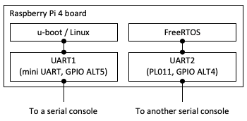

# raspi4_freertos

This repository includes a FreeRTOS UART sample application which can run on Raspberry Pi 4B.

## 1. Overview

This FreeRTOS porting uses UART2(PL011). The sample application is designed to be launched by u-boot and to operate together with 64-bit Linux.

## 2. Prerequisites

#### Linux installation

Install 64-bit Ubuntu or Debian on your Raspberry Pi 4B.
https://ubuntu.com/download/raspberry-pi
https://wiki.debian.org/RaspberryPi4

#### UART configuration



This figure illustrates an expected UART configuration. You need to prepare for two different serial consoles for each UART port dedicated to u-boot/Linux or FreeRTOS.

Connect uart1 and uart2 debug port.

#### Compiler installation

You need to install a GCC toolset for aarch64, and can get it from [2]. Don't forget to add its binary path to $PATH. This should be done on your Raspi4 Linux environment.

I used AArch64 ELF bare-metal target (aarch64-none-elf) version 9.2.1 for this repository.

[2] https://developer.arm.com/tools-and-software/open-source-software/developer-tools/gnu-toolchain/gnu-a/downloads

#### u-boot compilation

A pre-built u-boot image provided by Ubuntu or Debian may not have the `dcache` command on the u-boot prompt. You need compile and install u-boot having cache management commands if u-boot provided by your Linux distribution does not have them.

(1) Source code download  
`$ git clone https://github.com/u-boot/u-boot`  

(2) Compilation
```bash
$ cd u-boot
$ export CROSS_COMPILE=aarch64-none-elf-
$ echo 'CONFIG_CMD_CACHE=y' >> ./configs/rpi_4_defconfig
$ make rpi_4_defconfig
$ make -j4 (if your PC has 4 processor cores)
```
(`CROSS_COMPILE` must be changed depending on a compiler you installed)

(3) Copy the binary to your SD card  
```bash
$ sudo cp ./u-boot.bin /path/to/sd_boot_partition/kernel8.img
```
(The new file name must be `kernel8.img`)

## 3. FreeRTOS UART sample build

1. Clone the repository:

```bash
git clone https://github.com/TImada/raspi4_freertos.git
```
2. Download the patch file `uart1-uboot-uart2-freertos.patch`.

3. Apply the patch:
   
```bash
git apply uart1-uboot-uart2-freertos.patch

```
4. Navigate to the UART directory:
   
```bash
$ cd Demo/CORTEX_A72_64-bit_Raspberrypi4/uart
$ make
```

## 4. Launching FreeRTOS by u-boot

(1) Copy the obtained binary to your SD card
```
$ sudo ./uart.elf /path/to/sd_boot_partition/
```

(2) Get the u-boot command on your Raspberry Pi 4B board  
Insert your SD card into your board, then power it on.

(3) Launch the FreeRTOS sample program on the u-boot prompt
```
setenv autostart yes
dcache off
fatload mmc 0:1 0x28000000 /path/to/uart.elf
dcache flush
bootelf 0x28000000
go 0x20001788
```

## Sample Output

Hello World !!!                                                                                                                   
FreeRTOS command server.                                                                                                                                                               
Type Help to view a list of registered commands.                                                                                                                                       
                                                                                                                                                                                       
\> help                                                                                                                                                                                  
                                                                                                                                                                                       
help:                                                                                                                                                                                  
 Lists all the registered commands                                                                                                                                                     
                                                                                                                                                                                       
                                                                                                                                                                                       
task-stats:                                                                                                                                                                            
 Displays a table showing the state of each FreeRTOS task                                                                                                                              
                                                                                                                                                                                       
echo-3-parameters <param1> <param2> <param3>:                                                                                                                                          
 Expects three parameters, echos each in turn                                                                                                                                          
                                                                                                                                                                                       
echo-parameters <...>:                                                                                                                                                                 
 Take variable number of parameters, echos each in turn                                                                                                                                
                                                                                                                                                                                       
task-stats:                                                                                                                                                                            
 Displays a table showing the state of each FreeRTOS task                                                                                                                              
                                                                                                                                                                                       
echo-3-parameters <param1> <param2> <param3>:                                                                                                                                          
 Expects three parameters, echos each in turn                                                                                                                                          
                                                                                                                                                                                       
echo-parameters <...>:                                                                                                                                                                 
 Take variable number of parameters, echos each in turn                                                                                                                                
                                                                                                                                                                                       
[Press ENTER to execute the previous command again]  

